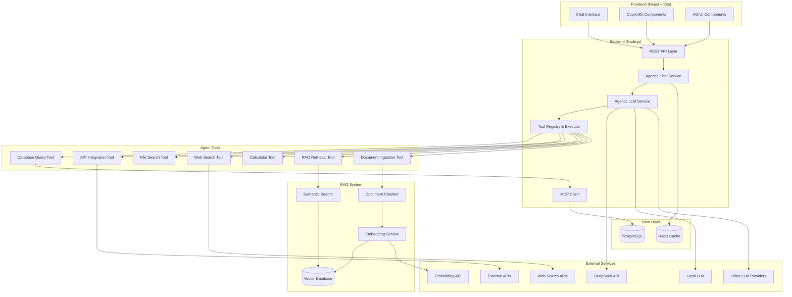

# AI Chat App Design Document

## Overview

The AI Chat application is a full-stack solution consisting of a React + Vite frontend with CopilotKit integration and a Node.js backend. The system provides natural language chat capabilities with database integration and supports multiple LLM providers through a generic adapter pattern. The application implements AG-UI protocol for enhanced user interactions and maintains conversation persistence.

## Architecture

### High-Level Architecture



### Technology Stack

**Frontend:**
- React 18 with TypeScript
- Vite for build tooling
- CopilotKit for AI-enhanced interactions
- AG-UI protocol implementation
- Tailwind CSS for styling
- React Query for state management
- Socket.io-client for real-time updates

**Backend:**
- Node.js with Express.js
- TypeScript
- Socket.io for real-time communication
- Agentic LLM adapter with tool calling support
- MCP (Model Context Protocol) integration
- Tool registry and execution engine
- PostgreSQL for data persistence
- Redis for caching and session management

**RAG & Vector Components:**
- Vector database (Pinecone/Weaviate/Qdrant) for semantic search
- Embedding service for text vectorization
- Document ingestion pipeline with chunking strategies
- Semantic search and retrieval system
- Knowledge base management with versioning
- Hybrid search (vector + keyword) capabilities

**Agentic Components:**
- Tool Registry for extensible agent capabilities
- MCP Client for database and external system integration
- Function calling support for all major LLM providers
- Secure tool execution with permission management
- API integration framework with rate limiting
- Tool result caching and optimization
- RAG-enhanced context retrieval tools

## Components and Interfaces

### Frontend Components

#### Core Chat Components
```typescript
// Chat Interface Component
interface ChatInterfaceProps {
  conversationId?: string;
  onMessageSent: (message: string) => void;
}

// Message Component with AG-UI support
interface MessageProps {
  message: ChatMessage;
  isUser: boolean;
  agUIElements?: AGUIElement[];
}

// CopilotKit Integration
interface CopilotChatProps {
  instructions: string;
  onFunctionCall: (name: string, args: any) => Promise<any>;
}
```

#### AG-UI Components
```typescript
interface AGUIElement {
  type: 'button' | 'form' | 'chart' | 'table' | 'card';
  id: string;
  props: Record<string, any>;
  action?: string;
}

interface AGUIButtonProps {
  label: string;
  action: string;
  variant: 'primary' | 'secondary' | 'danger';
}
```

### Backend Services

#### Agentic LLM Service
```typescript
interface AgenticLLMProvider {
  name: string;
  generateResponse(prompt: string, context?: any): Promise<LLMResponse>;
  supportsToolCalling(): boolean;
  generateWithTools(prompt: string, tools: AgentTool[], context?: any): Promise<AgenticResponse>;
  validateConfig(): boolean;
}

interface LLMResponse {
  content: string;
  usage?: {
    promptTokens: number;
    completionTokens: number;
  };
  agUIElements?: AGUIElement[];
}

interface AgenticResponse extends LLMResponse {
  toolCalls?: ToolCall[];
  requiresToolExecution: boolean;
  conversationState: 'complete' | 'awaiting_tool_results' | 'error';
}

interface ToolCall {
  id: string;
  toolName: string;
  arguments: Record<string, any>;
}

// Agentic LLM Adapter with Tool Support
class AgenticLLMAdapter {
  private provider: AgenticLLMProvider;
  private toolRegistry: ToolRegistry;
  
  constructor() {
    this.provider = this.createProvider();
    this.toolRegistry = new ToolRegistry();
    this.registerDefaultTools();
  }
  
  private createProvider(): AgenticLLMProvider {
    const providerType = process.env.LLM_PROVIDER;
    switch (providerType) {
      case 'deepseek':
        return new DeepSeekAgenticProvider();
      case 'local':
        return new LocalAgenticLLMProvider();
      case 'openai':
        return new OpenAIAgenticProvider();
      default:
        throw new Error(`Unsupported LLM provider: ${providerType}`);
    }
  }
  
  private registerDefaultTools(): void {
    this.toolRegistry.register(new MCPDatabaseTool());
    this.toolRegistry.register(new APIIntegrationTool());
    this.toolRegistry.register(new FileSearchTool());
    this.toolRegistry.register(new CalculatorTool());
    this.toolRegistry.register(new WebSearchTool());
  }
  
  async processAgenticConversation(
    message: string, 
    context: ChatContext
  ): Promise<AgenticConversationResult> {
    const availableTools = this.toolRegistry.getAvailableTools(context.permissions);
    let response = await this.provider.generateWithTools(message, availableTools, context);
    
    // Handle tool execution loop
    while (response.requiresToolExecution) {
      const toolResults = await this.executeTools(response.toolCalls!, context);
      response = await this.provider.generateWithTools(
        this.buildToolResultPrompt(toolResults), 
        availableTools, 
        context
      );
    }
    
    return {
      finalResponse: response,
      toolExecutions: context.toolExecutions || []
    };
  }
}
```

#### Agent Tool System
```typescript
interface AgentTool {
  name: string;
  description: string;
  parameters: ToolParameter[];
  execute(args: Record<string, any>, context: ToolContext): Promise<ToolResult>;
}

interface ToolParameter {
  name: string;
  type: 'string' | 'number' | 'boolean' | 'object' | 'array';
  description: string;
  required: boolean;
  enum?: string[];
}

interface ToolResult {
  success: boolean;
  data?: any;
  error?: string;
  metadata?: Record<string, any>;
}

interface ToolContext {
  userId: string;
  conversationId: string;
  permissions: string[];
}

// MCP Integration for Database Queries
class MCPDatabaseTool implements AgentTool {
  name = 'query_database';
  description = 'Execute SQL queries against the database using natural language';
  parameters = [
    {
      name: 'query_description',
      type: 'string' as const,
      description: 'Natural language description of what data to retrieve',
      required: true
    },
    {
      name: 'table_hints',
      type: 'array' as const,
      description: 'Optional hints about which tables might be relevant',
      required: false
    }
  ];

  async execute(args: Record<string, any>, context: ToolContext): Promise<ToolResult> {
    // MCP implementation for database queries
    const mcpClient = new MCPClient();
    return await mcpClient.queryDatabase(args.query_description, args.table_hints);
  }
}

// API Integration Tool
class APIIntegrationTool implements AgentTool {
  name = 'call_external_api';
  description = 'Make HTTP requests to external APIs';
  parameters = [
    {
      name: 'endpoint',
      type: 'string' as const,
      description: 'API endpoint URL',
      required: true
    },
    {
      name: 'method',
      type: 'string' as const,
      description: 'HTTP method',
      required: true,
      enum: ['GET', 'POST', 'PUT', 'DELETE']
    },
    {
      name: 'headers',
      type: 'object' as const,
      description: 'Request headers',
      required: false
    },
    {
      name: 'body',
      type: 'object' as const,
      description: 'Request body for POST/PUT requests',
      required: false
    }
  ];

  async execute(args: Record<string, any>, context: ToolContext): Promise<ToolResult> {
    // Secure API call implementation with permission checks
    return await this.makeSecureAPICall(args, context);
  }
}
```

#### Agentic Chat Service
```typescript
interface AgenticChatService {
  processMessage(message: string, context: AgenticChatContext): Promise<AgenticChatResponse>;
  getConversationContext(conversationId: string): Promise<AgenticChatContext>;
  executeToolWorkflow(toolCalls: ToolCall[], context: AgenticChatContext): Promise<ToolExecutionResult[]>;
}

interface AgenticChatContext {
  conversationId: string;
  userId: string;
  history: ChatMessage[];
  permissions: string[];
  availableTools: string[];
  toolExecutions: ToolExecutionResult[];
  mcpConnections: MCPConnection[];
  apiConfigurations: APIConfiguration[];
}

interface AgenticChatResponse {
  message: ChatMessage;
  toolExecutions?: ToolExecutionResult[];
  suggestedActions?: SuggestedAction[];
  agUIElements?: AGUIElement[];
}

interface ToolExecutionResult {
  toolName: string;
  callId: string;
  success: boolean;
  result?: any;
  error?: string;
  executionTime: number;
}

interface MCPConnection {
  name: string;
  type: 'database' | 'file_system' | 'api' | 'custom';
  config: Record<string, any>;
  status: 'connected' | 'disconnected' | 'error';
}

interface APIConfiguration {
  name: string;
  baseUrl: string;
  authentication: {
    type: 'bearer' | 'api_key' | 'oauth' | 'none';
    config: Record<string, any>;
  };
  rateLimits: {
    requestsPerMinute: number;
    requestsPerHour: number;
  };
  allowedEndpoints: string[];
}

#### RAG Service
```typescript
interface RAGService {
  semanticSearch(params: SemanticSearchParams): Promise<SearchResult[]>;
  ingestDocument(params: DocumentIngestionParams): Promise<string>;
  updateDocument(documentId: string, params: DocumentUpdateParams): Promise<void>;
  deleteDocument(documentId: string): Promise<void>;
  getCollections(userId: string): Promise<Collection[]>;
  createCollection(params: CreateCollectionParams): Promise<string>;
}

interface SemanticSearchParams {
  query: string;
  topK: number;
  threshold: number;
  collection?: string;
  userId: string;
  filters?: Record<string, any>;
}

interface SearchResult {
  id: string;
  content: string;
  metadata: DocumentMetadata;
  score: number;
  collection: string;
}

interface DocumentIngestionParams {
  content: string;
  metadata: DocumentMetadata;
  collection: string;
  userId: string;
  chunkingStrategy?: ChunkingStrategy;
}

interface DocumentMetadata {
  title?: string;
  source?: string;
  author?: string;
  tags?: string[];
  createdAt?: Date;
  updatedAt?: Date;
  [key: string]: any;
}

interface ChunkingStrategy {
  type: 'fixed_size' | 'semantic' | 'sentence' | 'paragraph';
  size?: number;
  overlap?: number;
  preserveStructure?: boolean;
}

interface Collection {
  id: string;
  name: string;
  description?: string;
  userId: string;
  documentCount: number;
  createdAt: Date;
  updatedAt: Date;
}

#### Embedding Service
```typescript
interface EmbeddingService {
  generateEmbeddings(texts: string[]): Promise<number[][]>;
  generateSingleEmbedding(text: string): Promise<number[]>;
  getDimensions(): number;
  getModel(): string;
}

interface VectorDatabase {
  upsert(vectors: VectorRecord[]): Promise<void>;
  query(params: VectorQueryParams): Promise<VectorSearchResult[]>;
  delete(ids: string[]): Promise<void>;
  createCollection(name: string, dimension: number): Promise<void>;
  deleteCollection(name: string): Promise<void>;
}

interface VectorRecord {
  id: string;
  vector: number[];
  metadata: Record<string, any>;
}

interface VectorQueryParams {
  vector: number[];
  topK: number;
  threshold?: number;
  filter?: Record<string, any>;
  collection?: string;
}

interface VectorSearchResult {
  id: string;
  score: number;
  metadata: Record<string, any>;
}
```

### API Endpoints

```typescript
// REST API Routes
POST /api/chat/message
GET /api/chat/conversations/:userId
GET /api/chat/conversation/:conversationId
DELETE /api/chat/conversation/:conversationId
GET /api/health
POST /api/database/query

// WebSocket Events
'message:send' -> 'message:response'
'typing:start' -> 'typing:indicator'
'connection:status' -> 'connection:update'
```

## Data Models

### Core Data Models

```typescript
interface User {
  id: string;
  email: string;
  name: string;
  createdAt: Date;
  updatedAt: Date;
}

interface Conversation {
  id: string;
  userId: string;
  title: string;
  createdAt: Date;
  updatedAt: Date;
  messages: ChatMessage[];
}

interface ChatMessage {
  id: string;
  conversationId: string;
  content: string;
  role: 'user' | 'assistant';
  timestamp: Date;
  metadata?: {
    tokens?: number;
    model?: string;
    agUIElements?: AGUIElement[];
    databaseQuery?: string;
  };
}

interface DatabaseSchema {
  tables: Table[];
  relationships: Relationship[];
}

interface Table {
  name: string;
  columns: Column[];
  description?: string;
}

interface Column {
  name: string;
  type: string;
  nullable: boolean;
  description?: string;
}

interface Document {
  id: string;
  userId: string;
  collectionId: string;
  title: string;
  content: string;
  metadata: DocumentMetadata;
  chunks: DocumentChunk[];
  createdAt: Date;
  updatedAt: Date;
}

interface DocumentChunk {
  id: string;
  documentId: string;
  content: string;
  chunkIndex: number;
  startOffset: number;
  endOffset: number;
  vectorId?: string;
  embedding?: number[];
  metadata: Record<string, any>;
}

interface KnowledgeCollection {
  id: string;
  name: string;
  description?: string;
  userId: string;
  isPublic: boolean;
  documentCount: number;
  totalChunks: number;
  settings: CollectionSettings;
  createdAt: Date;
  updatedAt: Date;
}

interface CollectionSettings {
  chunkingStrategy: ChunkingStrategy;
  embeddingModel: string;
  searchSettings: {
    defaultTopK: number;
    similarityThreshold: number;
    enableHybridSearch: boolean;
    enableReranking: boolean;
  };
}
```

### Environment Configuration

```typescript
interface LLMConfig {
  provider: 'deepseek' | 'local' | 'openai' | 'anthropic';
  apiKey?: string;
  baseUrl?: string;
  model: string;
  maxTokens: number;
  temperature: number;
}

// Environment Variables
LLM_PROVIDER=deepseek
LLM_API_KEY=your_api_key
LLM_BASE_URL=https://api.deepseek.com
LLM_MODEL=deepseek-chat
LLM_MAX_TOKENS=4000
LLM_TEMPERATURE=0.7
LLM_SUPPORTS_TOOLS=true

DATABASE_URL=postgresql://...
REDIS_URL=redis://...

# MCP Configuration
MCP_DATABASE_ENABLED=true
MCP_DATABASE_TYPE=postgresql
MCP_FILE_SYSTEM_ENABLED=true
MCP_WEB_SEARCH_ENABLED=true
MCP_WEB_SEARCH_API_KEY=your_search_api_key

# Tool Permissions
TOOLS_ENABLED=database_query,api_integration,file_search,calculator,web_search
TOOLS_REQUIRE_APPROVAL=api_integration,file_search
TOOLS_AUTO_APPROVE=calculator,database_query

# API Integration Settings
API_RATE_LIMIT_ENABLED=true
API_DEFAULT_TIMEOUT=30000
API_MAX_RETRIES=3

# RAG & Vector Database Configuration
VECTOR_DB_PROVIDER=pinecone  # pinecone, weaviate, qdrant, chroma
VECTOR_DB_URL=https://your-index.pinecone.io
VECTOR_DB_API_KEY=your_vector_db_api_key
VECTOR_DB_INDEX_NAME=ai-chat-knowledge
VECTOR_DIMENSION=1536

# Embedding Service Configuration
EMBEDDING_PROVIDER=openai  # openai, cohere, huggingface, local
EMBEDDING_API_KEY=your_embedding_api_key
EMBEDDING_MODEL=text-embedding-3-small
EMBEDDING_BATCH_SIZE=100

# RAG Configuration
RAG_CHUNK_SIZE=1000
RAG_CHUNK_OVERLAP=200
RAG_DEFAULT_TOP_K=5
RAG_SIMILARITY_THRESHOLD=0.7
RAG_MAX_CONTEXT_LENGTH=8000
RAG_ENABLE_HYBRID_SEARCH=true
RAG_RERANK_ENABLED=true
RAG_RERANK_MODEL=cross-encoder/ms-marco-MiniLM-L-6-v2
```

## Error Handling

### Frontend Error Handling
- Global error boundary for React components
- Toast notifications for user-facing errors
- Retry mechanisms for failed API calls
- Graceful degradation when CopilotKit features fail
- Loading states and error states for all async operations

### Backend Error Handling
```typescript
class AppError extends Error {
  statusCode: number;
  isOperational: boolean;
  
  constructor(message: string, statusCode: number) {
    super(message);
    this.statusCode = statusCode;
    this.isOperational = true;
  }
}

// Error Types
class LLMProviderError extends AppError {}
class DatabaseError extends AppError {}
class ValidationError extends AppError {}
class AuthenticationError extends AppError {}
```

### Error Recovery Strategies
- LLM provider fallback mechanisms
- Database connection retry logic
- Circuit breaker pattern for external services
- Graceful degradation when database is unavailable
- Comprehensive logging with structured format

## Testing Strategy

### Frontend Testing
- Unit tests for React components using Jest and React Testing Library
- Integration tests for CopilotKit interactions
- E2E tests using Playwright for critical user flows
- Visual regression tests for UI components
- AG-UI component interaction tests

### Backend Testing
- Unit tests for services and utilities
- Integration tests for API endpoints
- Database integration tests with test containers
- LLM adapter tests with mocked providers
- Load testing for chat endpoints
- WebSocket connection tests

### Test Coverage Requirements
- Minimum 80% code coverage for backend services
- 70% coverage for frontend components
- 100% coverage for critical paths (authentication, message processing)
- Performance benchmarks for LLM response times
- Database query performance tests

## Agentic AI Patterns and Best Practices

### Tool Calling Architecture
The system implements a robust tool calling architecture following modern agentic AI patterns:

#### Tool Registry Pattern
```typescript
class ToolRegistry {
  private tools: Map<string, AgentTool> = new Map();
  
  register(tool: AgentTool): void {
    this.tools.set(tool.name, tool);
  }
  
  getAvailableTools(permissions: string[]): AgentTool[] {
    return Array.from(this.tools.values())
      .filter(tool => this.hasPermission(tool, permissions));
  }
  
  execute(toolName: string, args: any, context: ToolContext): Promise<ToolResult> {
    const tool = this.tools.get(toolName);
    if (!tool) throw new Error(`Tool ${toolName} not found`);
    return tool.execute(args, context);
  }
}
```

#### MCP Integration Strategy
- **Database Queries**: Use MCP for secure, schema-aware database interactions
- **File System Access**: MCP handles file operations with proper sandboxing
- **External APIs**: MCP provides standardized interface for API integrations
- **Custom Protocols**: Extensible MCP implementation for domain-specific tools

#### Function Calling Best Practices
1. **Parallel Tool Execution**: Execute independent tools concurrently
2. **Tool Result Validation**: Validate all tool outputs before passing to LLM
3. **Error Recovery**: Implement fallback strategies for failed tool calls
4. **Context Preservation**: Maintain conversation context across tool executions
5. **Permission Management**: Granular permissions for different tool categories

### Agentic Conversation Flow
```typescript
async function processAgenticMessage(message: string, context: AgenticChatContext): Promise<AgenticChatResponse> {
  let conversationComplete = false;
  let currentMessage = message;
  const toolExecutions: ToolExecutionResult[] = [];
  
  while (!conversationComplete) {
    const response = await llmProvider.generateWithTools(currentMessage, availableTools, context);
    
    if (response.toolCalls && response.toolCalls.length > 0) {
      // Execute tools in parallel where possible
      const toolResults = await executeToolsInParallel(response.toolCalls, context);
      toolExecutions.push(...toolResults);
      
      // Prepare next iteration with tool results
      currentMessage = formatToolResultsForLLM(toolResults);
    } else {
      conversationComplete = true;
      return {
        message: response.content,
        toolExecutions,
        agUIElements: response.agUIElements
      };
    }
  }
}
```

### Security and Permissions
- **Tool Sandboxing**: Each tool runs in isolated execution context
- **Permission-Based Access**: Users have granular permissions for different tool categories
- **API Rate Limiting**: Prevent abuse of external API integrations
- **Input Validation**: Strict validation of all tool parameters
- **Audit Logging**: Complete audit trail of all tool executions

### RAG Integration Patterns

#### Retrieval-Augmented Generation Flow
```typescript
async function processRAGEnhancedMessage(
  message: string, 
  context: AgenticChatContext
): Promise<AgenticChatResponse> {
  // 1. Determine if RAG retrieval is needed
  const needsRetrieval = await shouldUseRAG(message, context);
  
  if (needsRetrieval) {
    // 2. Perform semantic search
    const retrievalResults = await ragService.semanticSearch({
      query: message,
      topK: 5,
      threshold: 0.7,
      userId: context.userId
    });
    
    // 3. Enhance context with retrieved knowledge
    const enhancedContext = {
      ...context,
      retrievedKnowledge: retrievalResults,
      ragMetadata: {
        searchQuery: message,
        resultsCount: retrievalResults.length,
        collections: [...new Set(retrievalResults.map(r => r.collection))]
      }
    };
    
    // 4. Generate response with RAG context
    return await agenticLLMService.processMessage(message, enhancedContext);
  }
  
  // Standard processing without RAG
  return await agenticLLMService.processMessage(message, context);
}
```

#### Hybrid Search Implementation
```typescript
class HybridSearchService {
  async search(params: HybridSearchParams): Promise<SearchResult[]> {
    // Parallel execution of vector and keyword search
    const [vectorResults, keywordResults] = await Promise.all([
      this.vectorSearch(params),
      this.keywordSearch(params)
    ]);
    
    // Combine and rerank results
    const combinedResults = this.combineResults(vectorResults, keywordResults);
    
    if (params.enableReranking) {
      return await this.rerankResults(combinedResults, params.query);
    }
    
    return combinedResults;
  }
  
  private combineResults(
    vectorResults: VectorSearchResult[], 
    keywordResults: KeywordSearchResult[]
  ): SearchResult[] {
    // Reciprocal Rank Fusion (RRF) algorithm
    const k = 60; // RRF parameter
    const scoreMap = new Map<string, number>();
    
    vectorResults.forEach((result, index) => {
      const score = 1 / (k + index + 1);
      scoreMap.set(result.id, (scoreMap.get(result.id) || 0) + score);
    });
    
    keywordResults.forEach((result, index) => {
      const score = 1 / (k + index + 1);
      scoreMap.set(result.id, (scoreMap.get(result.id) || 0) + score);
    });
    
    // Convert to final results and sort by combined score
    return Array.from(scoreMap.entries())
      .sort(([, a], [, b]) => b - a)
      .map(([id, score]) => this.buildSearchResult(id, score));
  }
}
```

#### Document Processing Pipeline
```typescript
class DocumentProcessor {
  async processDocument(params: DocumentIngestionParams): Promise<string> {
    // 1. Extract and clean text
    const cleanedContent = await this.cleanText(params.content);
    
    // 2. Apply chunking strategy
    const chunks = await this.chunkDocument(cleanedContent, params.chunkingStrategy);
    
    // 3. Generate embeddings for chunks
    const embeddings = await this.embeddingService.generateEmbeddings(
      chunks.map(chunk => chunk.content)
    );
    
    // 4. Store in vector database
    const vectorRecords = chunks.map((chunk, index) => ({
      id: `${params.collection}_${chunk.id}`,
      vector: embeddings[index],
      metadata: {
        ...chunk.metadata,
        documentId: chunk.documentId,
        collection: params.collection,
        userId: params.userId
      }
    }));
    
    await this.vectorDB.upsert(vectorRecords);
    
    // 5. Store document metadata in PostgreSQL
    return await this.documentRepository.save({
      ...params,
      chunks,
      status: 'processed'
    });
  }
  
  private async chunkDocument(
    content: string, 
    strategy: ChunkingStrategy
  ): Promise<DocumentChunk[]> {
    switch (strategy.type) {
      case 'semantic':
        return await this.semanticChunking(content, strategy);
      case 'sentence':
        return await this.sentenceChunking(content, strategy);
      case 'paragraph':
        return await this.paragraphChunking(content, strategy);
      default:
        return await this.fixedSizeChunking(content, strategy);
    }
  }
}
```

#### RAG-Enhanced Tool Integration
```typescript
// Enhanced database tool with RAG context
class RAGEnhancedDatabaseTool extends MCPDatabaseTool {
  async execute(args: Record<string, any>, context: ToolContext): Promise<ToolResult> {
    // First, search for relevant schema documentation
    const schemaContext = await this.ragService.semanticSearch({
      query: `database schema documentation ${args.query_description}`,
      collection: 'database_docs',
      topK: 3,
      userId: context.userId
    });
    
    // Enhance the query with retrieved context
    const enhancedQuery = this.buildEnhancedQuery(args.query_description, schemaContext);
    
    // Execute the original database query with enhanced context
    return await super.execute({ ...args, query_description: enhancedQuery }, context);
  }
}
```

### Extensibility Framework
The system is designed for easy extension with new tools and capabilities:

```typescript
// RAG Retrieval Tool
class RAGRetrievalTool implements AgentTool {
  name = 'search_knowledge_base';
  description = 'Search the knowledge base using semantic similarity';
  
  parameters = [
    {
      name: 'query',
      type: 'string' as const,
      description: 'Search query for semantic retrieval',
      required: true
    },
    {
      name: 'top_k',
      type: 'number' as const,
      description: 'Number of results to retrieve (default: 5)',
      required: false
    },
    {
      name: 'threshold',
      type: 'number' as const,
      description: 'Similarity threshold (0-1, default: 0.7)',
      required: false
    },
    {
      name: 'collection',
      type: 'string' as const,
      description: 'Specific knowledge collection to search',
      required: false
    }
  ];
  
  async execute(args: Record<string, any>, context: ToolContext): Promise<ToolResult> {
    const ragService = new RAGService();
    const results = await ragService.semanticSearch({
      query: args.query,
      topK: args.top_k || 5,
      threshold: args.threshold || 0.7,
      collection: args.collection,
      userId: context.userId
    });
    
    return {
      success: true,
      data: results,
      metadata: { 
        source: 'knowledge_base',
        searchType: 'semantic',
        resultsCount: results.length
      }
    };
  }
}

// Document Ingestion Tool
class DocumentIngestionTool implements AgentTool {
  name = 'ingest_document';
  description = 'Ingest and vectorize documents into the knowledge base';
  
  parameters = [
    {
      name: 'content',
      type: 'string' as const,
      description: 'Document content to ingest',
      required: true
    },
    {
      name: 'metadata',
      type: 'object' as const,
      description: 'Document metadata (title, source, tags, etc.)',
      required: false
    },
    {
      name: 'collection',
      type: 'string' as const,
      description: 'Knowledge collection to add document to',
      required: false
    }
  ];
  
  async execute(args: Record<string, any>, context: ToolContext): Promise<ToolResult> {
    const ragService = new RAGService();
    const documentId = await ragService.ingestDocument({
      content: args.content,
      metadata: args.metadata || {},
      collection: args.collection || 'default',
      userId: context.userId
    });
    
    return {
      success: true,
      data: { documentId, status: 'ingested' },
      metadata: { source: 'document_ingestion' }
    };
  }
}
```

## Performance Considerations

### Frontend Optimization
- Code splitting for CopilotKit components
- Virtual scrolling for long conversation histories
- Debounced typing indicators
- Optimistic UI updates for better perceived performance
- Service worker for offline message queuing

### Backend Optimization
- Redis caching for conversation context
- Database connection pooling
- LLM response streaming for better UX
- Rate limiting to prevent abuse
- Background job processing for heavy database queries

### Monitoring and Observability
- Application performance monitoring (APM)
- LLM usage and cost tracking
- Database query performance monitoring
- Real-time error tracking and alerting
- User interaction analytics for UX improvements