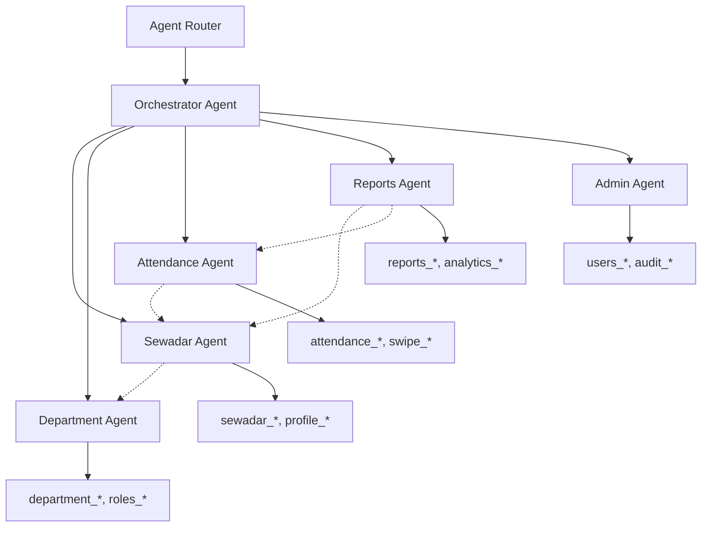

# Multi-Agent System Implementation Plan

## 🎯 Executive Summary

Transform the current monolithic PostgreSQL agent into a sophisticated multi-agent system where specialized agents handle domain-specific tasks (Sewadar, Department, Attendance, etc.) while maintaining inter-agent communication for complex queries requiring multiple data sources.

## 🏗️ Current Architecture Analysis

### Existing System Strengths
- ✅ Unified LLM Service supporting 7 providers
- ✅ Token-optimized schema handling
- ✅ Natural language to SQL conversion
- ✅ AGUI action registry system
- ✅ Chart visualization capabilities
- ✅ Robust database connection handling

### Limitations for Multi-Domain Scenarios
- ❌ Single monolithic agent handles all tables
- ❌ No context separation between domains
- ❌ Schema overwhelm for large databases
- ❌ No specialized knowledge per domain
- ❌ No inter-agent communication

## 🧠 Multi-Agent Architecture Design

### Core Principles

1. **Domain Specialization**: Each agent focuses on specific business domains
2. **Context Isolation**: Agents work with filtered schemas relevant to their domain
3. **Inter-Agent Communication**: Agents can request data/context from other agents
4. **Unified Interface**: Single entry point routes queries to appropriate agents
5. **Token Efficiency**: Each agent sees only relevant schema, reducing token usage

### Agent Hierarchy



## 🤖 Agent Specifications

### 1. Sewadar Agent
**Domain**: Sewadar profiles, personal information, eligibility
**Tables**: `sewadar_*`, `profile_*`, `eligibility_*`, `contact_*`
**Capabilities**:
- Personal information queries
- Eligibility verification
- Contact management
- Profile updates
**Sample Queries**:
- "Show me sewadar with badge S12345"
- "Find all eligible sewadars for IT department"
- "List sewadars from Delhi region"

### 2. Department Agent
**Domain**: Department structure, roles, assignments
**Tables**: `department_*`, `roles_*`, `assignments_*`, `hierarchy_*`
**Capabilities**:
- Department structure queries
- Role management
- Assignment tracking
- Hierarchy visualization
**Sample Queries**:
- "Show IT department structure"
- "List all department heads"
- "Find departments with open positions"

### 3. Attendance Agent
**Domain**: Attendance tracking, swipes, leave management
**Tables**: `attendance_*`, `swipe_*`, `leave_*`, `events_*`
**Capabilities**:
- Attendance analysis
- Swipe pattern detection
- Leave tracking
- Event attendance
**Sample Queries**:
- "Show attendance for last month"
- "Find sewadars with irregular attendance"
- "Calculate total hours for department"

### 4. Reports Agent
**Domain**: Analytics, reports, dashboards
**Tables**: `reports_*`, `analytics_*`, `metrics_*`, `kpi_*`
**Capabilities**:
- Cross-domain analytics
- Report generation
- KPI calculation
- Dashboard data
**Sample Queries**:
- "Generate monthly department report"
- "Show attendance trends by region"
- "Calculate productivity metrics"

### 5. Admin Agent
**Domain**: System administration, user management, audit
**Tables**: `users_*`, `audit_*`, `permissions_*`, `config_*`
**Capabilities**:
- User management
- Audit tracking
- Permission control
- System configuration
**Sample Queries**:
- "Show recent admin activities"
- "List users with admin access"
- "Generate audit report"

## 🔄 Inter-Agent Communication Protocol

### Message Format
```typescript
interface AgentMessage {
  id: string;
  from: string;
  to: string;
  type: 'request' | 'response' | 'broadcast';
  action: string;
  payload: any;
  context?: SharedContext;
  timestamp: Date;
}

interface SharedContext {
  originalQuery: string;
  userId: string;
  sessionId: string;
  relatedData: Record<string, any>;
  confidence: number;
}
```

### Communication Patterns

#### 1. Direct Request
```typescript
// Attendance Agent requests sewadar details
{
  from: 'attendance',
  to: 'sewadar',
  type: 'request',
  action: 'getSewadarBasics',
  payload: { badges: ['S12345', 'S67890'] }
}
```

#### 2. Context Sharing
```typescript
// Sewadar Agent shares context with Attendance Agent
{
  from: 'sewadar',
  to: 'attendance',
  type: 'response',
  action: 'contextShare',
  payload: { sewadars: [...] },
  context: { relatedData: { eligibleSewadars: [...] } }
}
```

#### 3. Broadcast
```typescript
// Reports Agent broadcasts request to all agents
{
  from: 'reports',
  to: '*',
  type: 'broadcast',
  action: 'monthlyDataRequest',
  payload: { month: '2024-01', includeMetrics: true }
}
```

## 🏛️ Implementation Architecture

### Core Components

#### 1. Base Agent Framework
```typescript
abstract class BaseAgent {
  protected agentId: string;
  protected domain: string;
  protected tables: string[];
  protected llmService: UnifiedLLMService;
  protected messenger: AgentMessenger;
  protected schema: TableSchema[];

  abstract async processQuery(query: string, context?: SharedContext): Promise<AgentResult>;
  abstract async handleMessage(message: AgentMessage): Promise<AgentMessage | null>;
  
  protected async getFilteredSchema(): Promise<TableSchema[]>;
  protected async requestFromAgent(targetAgent: string, action: string, payload: any): Promise<any>;
  protected async shareContext(context: SharedContext): Promise<void>;
}
```

#### 2. Agent Messenger
```typescript
class AgentMessenger {
  private agents: Map<string, BaseAgent>;
  private messageQueue: AgentMessage[];
  
  async sendMessage(message: AgentMessage): Promise<AgentMessage | null>;
  async broadcastMessage(message: AgentMessage): Promise<AgentMessage[]>;
  async registerAgent(agent: BaseAgent): Promise<void>;
  async routeMessage(message: AgentMessage): Promise<void>;
}
```

#### 3. Orchestrator Agent
```typescript
class OrchestratorAgent extends BaseAgent {
  async processQuery(query: string): Promise<AgentResult> {
    // 1. Analyze query to determine required agents
    const requiredAgents = await this.analyzeQueryRequirements(query);
    
    // 2. Route to primary agent
    const primaryResult = await this.routeToAgent(requiredAgents.primary, query);
    
    // 3. Collect additional context from secondary agents
    const additionalContext = await this.gatherAdditionalContext(
      requiredAgents.secondary, 
      primaryResult
    );
    
    // 4. Merge and return comprehensive result
    return this.mergeResults(primaryResult, additionalContext);
  }
}
```

### Configuration System

#### Agent Configuration
```yaml
# config/agents.yml
agents:
  sewadar:
    tables:
      - "sewadar_*"
      - "profile_*" 
      - "eligibility_*"
      - "contact_*"
    specialization: "Personal information and eligibility"
    dependencies: ["department"]
    
  department:
    tables:
      - "department_*"
      - "roles_*"
      - "assignments_*"
    specialization: "Department structure and roles"
    dependencies: []
    
  attendance:
    tables:
      - "attendance_*"
      - "swipe_*"
      - "leave_*"
    specialization: "Attendance and time tracking"
    dependencies: ["sewadar", "department"]
```

#### Query Routing Rules
```yaml
# config/routing.yml
routing_rules:
  - pattern: "sewadar|badge|profile|personal"
    primary_agent: "sewadar"
    secondary_agents: []
    
  - pattern: "attendance|swipe|present|absent"
    primary_agent: "attendance"
    secondary_agents: ["sewadar"]
    
  - pattern: "department.*attendance"
    primary_agent: "attendance"
    secondary_agents: ["sewadar", "department"]
    
  - pattern: "report|analytics|metrics"
    primary_agent: "reports"
    secondary_agents: ["sewadar", "attendance", "department"]
```

## 🚀 Implementation Phases

### Phase 1: Foundation (Week 1-2)
- [ ] Create base agent framework
- [ ] Implement agent messenger system
- [ ] Build configuration management
- [ ] Create agent registry
- [ ] Setup basic routing

### Phase 2: Core Agents (Week 3-4)
- [ ] Implement Sewadar Agent
- [ ] Implement Department Agent  
- [ ] Implement Attendance Agent
- [ ] Basic inter-agent communication
- [ ] Schema filtering per agent

### Phase 3: Orchestration (Week 5-6)
- [ ] Build Orchestrator Agent
- [ ] Advanced query routing
- [ ] Context sharing mechanisms
- [ ] Multi-agent query processing
- [ ] Result merging logic

### Phase 4: Advanced Features (Week 7-8)
- [ ] Reports Agent implementation
- [ ] Admin Agent implementation
- [ ] Context caching
- [ ] Performance optimization
- [ ] Error handling and fallbacks

### Phase 5: Integration & Testing (Week 9-10)
- [ ] Frontend integration
- [ ] Comprehensive testing
- [ ] Performance benchmarking
- [ ] Documentation
- [ ] Production deployment

## 📁 Directory Structure

```
backend/src/
├── agents/
│   ├── base/
│   │   ├── BaseAgent.ts
│   │   ├── AgentMessenger.ts
│   │   └── AgentRegistry.ts
│   ├── specialized/
│   │   ├── SewadarAgent.ts
│   │   ├── DepartmentAgent.ts
│   │   ├── AttendanceAgent.ts
│   │   ├── ReportsAgent.ts
│   │   └── AdminAgent.ts
│   ├── orchestrator/
│   │   ├── OrchestratorAgent.ts
│   │   └── QueryRouter.ts
│   └── config/
│       ├── AgentConfig.ts
│       └── RoutingConfig.ts
├── services/
│   ├── agents/
│   │   ├── AgentService.ts
│   │   └── MessageBus.ts
│   └── llm/
│       └── AgentLLMService.ts (extended)
└── routes/
    ├── multi-agent.ts
    └── agents/
        ├── sewadar-agent.ts (enhanced)
        ├── department-agent.ts
        └── attendance-agent.ts
```

## 🎯 Usage Examples

### Simple Domain Query
```typescript
// User: "Show me sewadar with badge S12345"
// → Routes to Sewadar Agent only
// → Returns sewadar profile with basic info
```

### Cross-Domain Query
```typescript
// User: "Show attendance summary for IT department sewadars"
// → Routes to Attendance Agent (primary)
// → Attendance Agent requests department sewadars from Department Agent
// → Attendance Agent requests sewadar details from Sewadar Agent
// → Returns comprehensive attendance report with sewadar details
```

### Complex Analytics Query
```typescript
// User: "Generate monthly productivity report for all departments"
// → Routes to Reports Agent (primary)
// → Reports Agent coordinates with all other agents
// → Collects attendance, department, and sewadar data
// → Generates comprehensive analytics report
```

## 🔧 API Design

### Multi-Agent Endpoint
```typescript
POST /api/multi-agent/query
{
  "query": "Show attendance for IT department sewadars last month",
  "options": {
    "includeDetails": true,
    "visualize": true,
    "maxAgents": 3
  }
}

Response:
{
  "success": true,
  "primaryAgent": "attendance",
  "involvedAgents": ["attendance", "department", "sewadar"],
  "data": [...],
  "context": {...},
  "summary": "...",
  "agui": [...]
}
```

### Direct Agent Access
```typescript
POST /api/agents/sewadar/query
POST /api/agents/department/query
POST /api/agents/attendance/query
```

### Agent Communication Debug
```typescript
GET /api/agents/messages
GET /api/agents/health
GET /api/agents/topology
```

## 🚦 Performance Considerations

### Token Optimization
- Each agent sees only relevant schema (90% token reduction)
- Context sharing reduces redundant LLM calls
- Cached agent responses for repeated queries

### Query Efficiency
- Parallel agent execution where possible
- Intelligent query decomposition
- Result caching and deduplication

### Scalability
- Stateless agent design
- Message queue for high load
- Agent pool management

## 🔒 Security & Access Control

### Agent Permissions
```typescript
interface AgentPermissions {
  tables: string[];
  operations: ('SELECT' | 'INSERT' | 'UPDATE' | 'DELETE')[];
  dataFilters: string[];
  userContext: boolean;
}
```

### Context Isolation
- Agents only access permitted tables
- User context propagated securely
- Audit trail for inter-agent communications

## 📊 Success Metrics

### Performance Metrics
- Response time per agent < 2 seconds
- Multi-agent query completion < 10 seconds
- Token usage reduced by 70% per query
- Schema filtering effectiveness > 90%

### Quality Metrics  
- SQL generation accuracy > 95%
- Inter-agent communication success > 99%
- Context sharing relevance > 90%
- User satisfaction with specialized responses

### Operational Metrics
- Agent uptime > 99.9%
- Message queue processing latency < 100ms
- Error recovery success rate > 95%
- Query routing accuracy > 98%

## 🎓 Benefits

### For Users
- Faster, more accurate responses
- Domain-specific expertise
- Reduced complexity in queries
- Better context understanding

### For Developers
- Modular, maintainable code
- Clear separation of concerns
- Easier testing and debugging
- Scalable architecture

### For System
- Reduced token usage
- Better performance
- Higher accuracy
- Improved maintainability

---

**Next Steps**: Begin with Phase 1 implementation, starting with the base agent framework and messenger system.