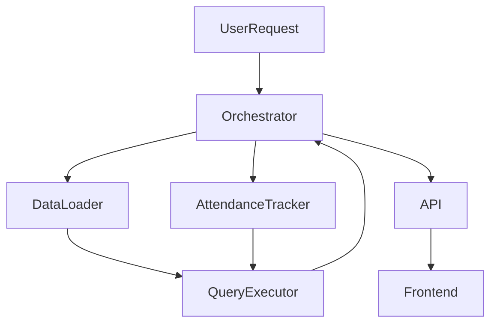

# Sewadar Agent System – Architecture & Implementation Plan

## 1. Overview

Design a modular agentic system for sewadar data management and attendance tracking, analogous to the Postgres SQL Agent. Agents will load, process, and query sewadar-specific data, communicate with each other, and execute queries on SQL Server.

---

## 2. Architecture

### 2.1. Core Components

- **Sewadar Data Loader Agent**
  - Loads sewadar master data (profiles, departments, eligibility, etc.)
  - Handles schema mapping and normalization

- **Attendance Tracker Agent**
  - Ingests attendance logs (swipes, manual entries, events)
  - Aggregates, validates, and links attendance to sewadar records

- **Query Executor Agent**
  - Receives structured queries from other agents
  - Executes on SQL Server (using parameterized queries)
  - Returns results, errors, and execution metadata

- **Inter-Agent Communication Layer**
  - Message bus (in-memory or event-driven)
  - Enables request/response and broadcast patterns

- **Orchestrator Agent**
  - Coordinates multi-agent workflows (e.g., eligibility + attendance)
  - Handles error recovery, retries, and logging

---

## 3. Agent Responsibilities

| Agent                | Responsibilities                                                                 |
|----------------------|----------------------------------------------------------------------------------|
| Data Loader          | Load, validate, and normalize sewadar master data                                |
| Attendance Tracker   | Process attendance logs, detect anomalies, link to sewadar IDs                   |
| Query Executor       | Securely execute SQL queries, enforce access control, return structured results  |
| Orchestrator         | Manage workflows, aggregate results, handle inter-agent dependencies             |

---

## 4. Data Flow

1. **Initialization**
   - Data Loader Agent loads sewadar master data from SQL Server
   - Attendance Tracker Agent loads attendance logs

2. **Processing**
   - Attendance Tracker links logs to sewadar records
   - Data normalization and enrichment

3. **Query Execution**
   - Orchestrator receives a user/system request (e.g., "Eligible sewadar attendance for IT department")
   - Orchestrator routes request to Data Loader and Attendance Tracker
   - Query Executor runs SQL queries and returns results

4. **Result Aggregation**
   - Orchestrator merges, formats, and returns final output

---

## 5. Integration Points

- **SQL Server Connection**
  - Use secure, pooled connections
  - Parameterized queries for safety

- **API Layer**
  - REST endpoints for agent orchestration
  - WebSocket/event bus for real-time updates

- **Frontend Integration**
  - Tabbed UI for sewadar profiles, attendance, eligibility, and analytics

---

## 6. Testing Strategy

- **Unit Tests**
  - Each agent: data loading, transformation, query execution

- **Integration Tests**
  - End-to-end workflow: eligibility + attendance + query

- **Mock Data**
  - Simulate sewadar records and attendance logs

- **Performance Tests**
  - Large-scale attendance ingestion and query execution

- **Security Tests**
  - SQL injection, access control, error handling

---

## 7. Next Steps

1. Define agent interfaces and message formats
2. Implement Data Loader and Attendance Tracker agents
3. Build Query Executor with SQL Server integration
4. Develop Orchestrator for workflow management
5. Integrate with API and frontend
6. Write comprehensive tests

---

## 8. Diagram

